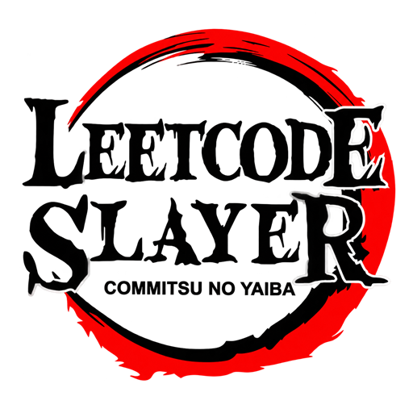

# Journey of CommitsuNoYaiba

> My learning archive to rebuild independent coding skills and prepare for software engineering interviews.

  

---

## About

I've built projects with AI, but I want to get better at writing code and explaining my decisions without relying on it.

This repo records my practice, mistakes, and reasoning—not just finished solutions.

Start with [the session guide](roadmap.md) and [the tracker](tracker.md).
